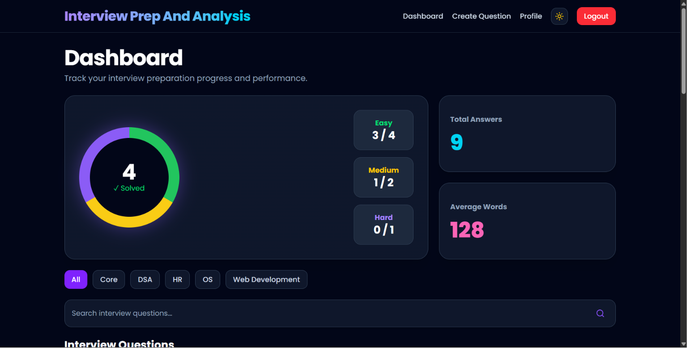
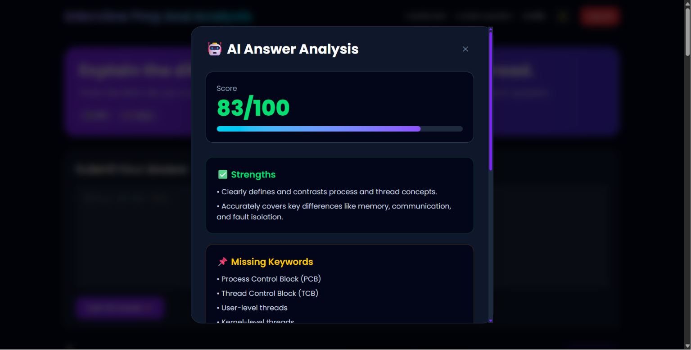
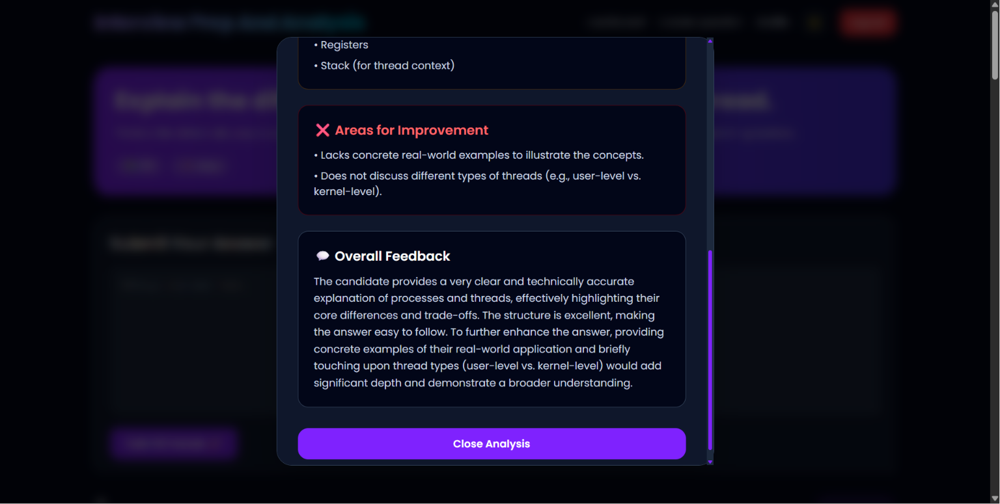
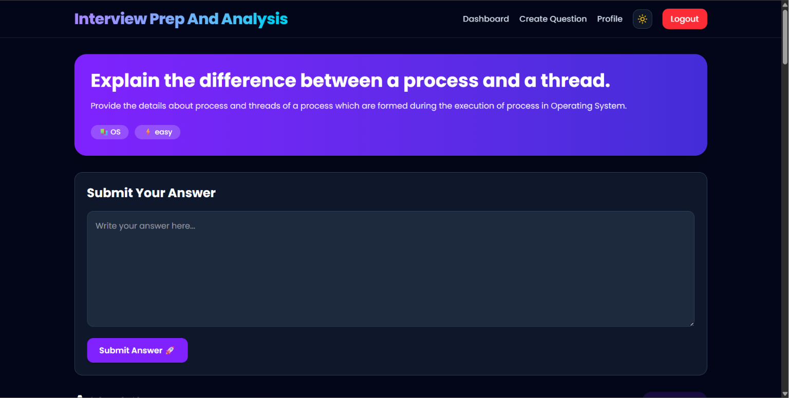
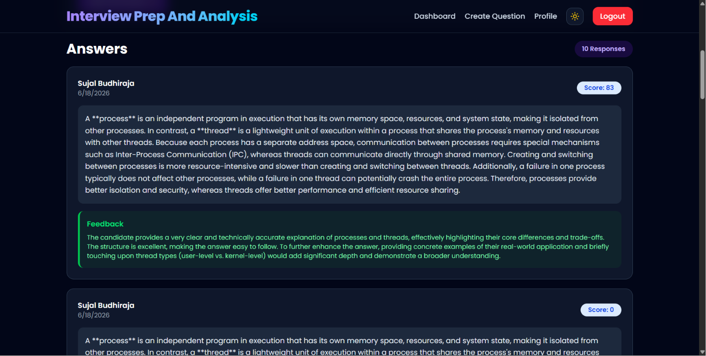
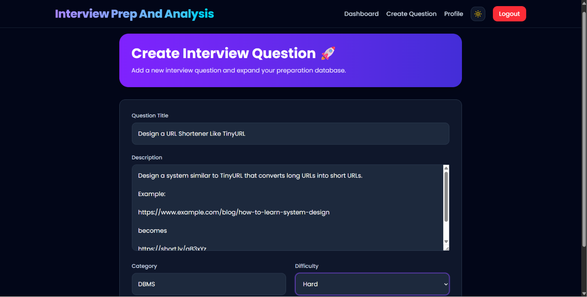
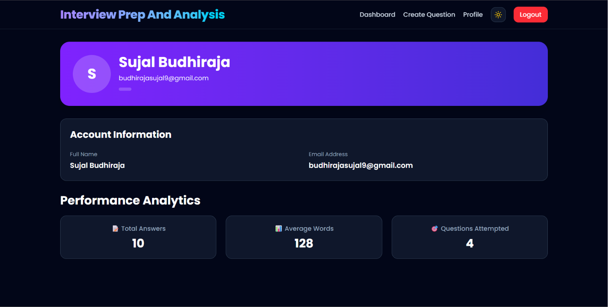

# Interview Prep & Analysis

An AI-powered MERN Stack platform that helps users practice interview questions, submit answers, and receive intelligent feedback using Google's Gemini AI.

## Features

### Authentication

* User Registration & Login
* JWT Authentication
* Protected Routes
* Password Hashing using bcrypt

### Interview Questions

* Create Interview Questions
* Dynamic Categories
* Difficulty Levels (Easy, Medium, Hard)
* Search Questions
* Category Filtering
* Pagination Support

### AI Answer Analysis

Powered by Google Gemini AI.

For every submitted answer, the system provides:

* AI Generated Score (0–100)
* Strengths Analysis
* Weaknesses Analysis
* Missing Keywords Detection
* Overall Feedback

### AI Question Validation

Before a question is created:

* Detects gibberish text
* Rejects meaningless questions
* Validates category relevance
* Ensures interview suitability

### Analytics Dashboard

Track your preparation progress:

* Total Answers Submitted
* Average Words per Answer
* Questions Attempted
* Difficulty-wise Progress
* Visual Analytics Cards

### UI Features

* Modern Responsive Design
* Dark Mode
* Light Mode
* Animated Components
* Professional Dashboard

### Security Features

* JWT Authentication
* Rate Limiting
* XSS Protection
* Input Sanitization
* Prompt Injection Protection
* Protected API Routes

---

## Screenshots

### Dashboard



---

### AI Answer Analysis




---

### Question Details




---

### Create Question



---

### Profile



---

## Tech Stack

### Frontend

* React.js
* Vite
* Tailwind CSS
* Axios
* React Router
* React Toastify

### Backend

* Node.js
* Express.js
* MongoDB
* Mongoose

### AI

* Google Gemini API

---

## Project Structure

```text
Interview_Prep_Analysis
│
├── Backend
│   ├── controllers
│   ├── middleware
│   ├── models
│   ├── routes
│   ├── utils
│   └── index.js
│
└── Frontend
    ├── src
    │   ├── api
    │   ├── components
    │   ├── context
    │   ├── pages
    │   └── assets
    └── public
```

## Installation

### Clone Repository

```bash
git clone https://github.com/018RAHUL/interview-prep-analysis.git
cd interview-prep-analysis
```

### Backend Setup

```bash
cd Backend

npm install
```

Create a `.env` file:

```env
PORT=5000
MONGO_URI=YOUR_MONGODB_URI
JWT_SECRET=YOUR_SECRET
GEMINI_API_KEY=YOUR_API_KEY
```

Start Backend:

```bash
npm run dev
```

### Frontend Setup

```bash
cd Frontend

npm install
npm run dev
```

Frontend:

```text
http://localhost:5173
```

Backend:

```text
http://localhost:5000
```

---

## Future Enhancements

* AI Generated Questions
* Leaderboard System
* Question Upvotes
* Interview Roadmaps
* Mock Interview Simulator
* Answer History Tracking
* Resume-Based Interview Generation

---

## Author

Sujal Budhiraja

Cyber Security Student | MERN Developer | AI Enthusiast

GitHub:
https://github.com/018RAHUL
